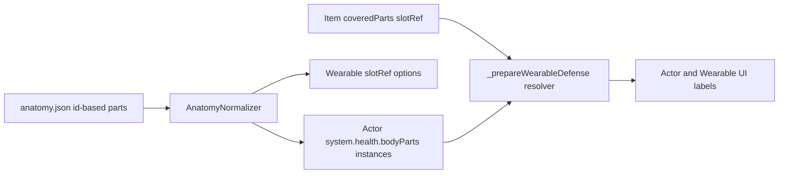

# План миграции анатомии: `id` + локализация + instance UUID

## Что делаем в этой итерации

- Переходим на схему, где в anatomy JSON не обязателен `name`, а отображаемое имя берётся из локализации по `id` (с fallback).
- Добавляем runtime-идентификацию экземпляров частей (`uuid`) и детерминированный `slotRef` для дублей (по порядку в anatomy файле).
- Для wearable вводим выбор **конкретного экземпляра** среди одинаковых частей (`instanceOnly`) через `slotRef`.
- Parent/каскадное удаление конечностей **не внедряем** в этом цикле (оставляем расширяемую точку в модели).

## Целевая модель данных

- **Source anatomy (JSON):** хранит описание частей без обязательного `name` и без `uuid`.
- **Runtime actor part:** хранит `uuid`, `id`, `slotRef`, `displayName` и боевые поля.
- **Wearable coverage:** хранит ссылку на конкретный экземпляр в виде `slotRef` + `value`.

Ключевые миграции структуры:

- `coveredParts: [{ partId, value }]` -> `coveredParts: [{ slotRef, value, partId? }]`
- `injury.partId` -> `injury.partUuid` (с backward fallback на `partId` для старых данных)

## Изменения по файлам

### 1) Нормализация и API анатомии

- Обновить [E:/FoundryVTT/Data/systems/spaceholder/module/anatomy-manager.mjs](E:/FoundryVTT/Data/systems/spaceholder/module/anatomy-manager.mjs):
  - Добавить единый normalizer: `normalizeAnatomyData()` для системных и world анатомий.
  - Добавить `resolveBodyPartName(id, explicitName?)` и `buildSlotRefs(parts)`.
  - Поддержать legacy-формат `bodyParts`-object и новый canonical-формат (мягкая миграция при загрузке).
  - На этапе `createActorAnatomy()` генерировать `uuid` и `slotRef` детерминированно по порядку в файле.

### 2) Актёр: derived-логика, травмы, защита wearable

- Обновить [E:/FoundryVTT/Data/systems/spaceholder/module/documents/actor.mjs](E:/FoundryVTT/Data/systems/spaceholder/module/documents/actor.mjs):
  - Перевести расчёты с `partId` на `partUuid`/`slotRef`-резолвинг.
  - Для `injuries` добавить поддержку `partUuid` (и fallback на старый `partId`).
  - В `_prepareWearableDefense` резолвить `coveredParts[].slotRef` в конкретную часть текущей анатомии.
  - Добавить безопасную миграцию существующих actor-данных при `setAnatomy`/`applyPreset`.

### 3) Wearable: хранение и редактирование покрытия по экземплярам

- Обновить [E:/FoundryVTT/Data/systems/spaceholder/module/sheets/item-sheet.mjs](E:/FoundryVTT/Data/systems/spaceholder/module/sheets/item-sheet.mjs):
  - Формировать список частей как список экземпляров (`slotRef`, `displayName`, `duplicateIndex`).
  - В `coveredList` и правой колонке работать через `slotRef`.
- Обновить [E:/FoundryVTT/Data/systems/spaceholder/module/helpers/wearable-coverage-editor.mjs](E:/FoundryVTT/Data/systems/spaceholder/module/helpers/wearable-coverage-editor.mjs):
  - Ключ выбора узла: `slotRef`, не `partId`.
- Обновить [E:/FoundryVTT/Data/systems/spaceholder/module/spaceholder.mjs](E:/FoundryVTT/Data/systems/spaceholder/module/spaceholder.mjs):
  - Диалоги edit/remove coverage и render-хуки перевести на `slotRef`.
  - Добавить миграцию old `coveredParts` (без `slotRef`) в новый формат при первом сохранении.
- Обновить [E:/FoundryVTT/Data/systems/spaceholder/template.json](E:/FoundryVTT/Data/systems/spaceholder/template.json):
  - Зафиксировать новую форму `coveredParts` (минимум в документации/ожиданиях к полям).

### 4) Actor UI и редактор анатомии

- Обновить [E:/FoundryVTT/Data/systems/spaceholder/module/sheets/actor-sheet.mjs](E:/FoundryVTT/Data/systems/spaceholder/module/sheets/actor-sheet.mjs):
  - В списках/указателе/диалогах травм использовать `partUuid` для выбора конкретной части.
  - Отображать дубли как `Имя (N)`; номер вычислять детерминированно по порядку.
- Обновить [E:/FoundryVTT/Data/systems/spaceholder/module/helpers/anatomy-editor.mjs](E:/FoundryVTT/Data/systems/spaceholder/module/helpers/anatomy-editor.mjs):
  - Перевести internal-операции на уникальный `uuid` части.
  - В UI редактирования: `id` обязателен, `name` сделать optional override (для custom).
  - Для добавления части: выбор из «готовых id» + ручной custom id/name.
- Обновить шаблоны:
  - [E:/FoundryVTT/Data/systems/spaceholder/templates/actor/parts/actor-health.hbs](E:/FoundryVTT/Data/systems/spaceholder/templates/actor/parts/actor-health.hbs)
  - [E:/FoundryVTT/Data/systems/spaceholder/templates/item/item-wearable-sheet.hbs](E:/FoundryVTT/Data/systems/spaceholder/templates/item/item-wearable-sheet.hbs)
  - Перейти на `slotRef`/`partUuid` в `data-*` атрибутах и отображение дублей.

### 5) Локализация и данные анатомий

- Обновить [E:/FoundryVTT/Data/systems/spaceholder/lang/ru.json](E:/FoundryVTT/Data/systems/spaceholder/lang/ru.json) и [E:/FoundryVTT/Data/systems/spaceholder/lang/en.json](E:/FoundryVTT/Data/systems/spaceholder/lang/en.json):
  - Добавить словарь имён частей тела по `id` (например `SPACEHOLDER.BodyParts.<id>`).
  - Добавить ключ формата дубля (например `SPACEHOLDER.BodyParts.DuplicateSuffix`).
- Обновить системные анатомии:
  - [E:/FoundryVTT/Data/systems/spaceholder/data/anatomy/humanoid.json](E:/FoundryVTT/Data/systems/spaceholder/data/anatomy/humanoid.json)
  - [E:/FoundryVTT/Data/systems/spaceholder/data/anatomy/quadruped.json](E:/FoundryVTT/Data/systems/spaceholder/data/anatomy/quadruped.json)
  - Убрать обязательность `name` у типовых частей, оставить только если это custom override.

### 6) Документация и обратная совместимость

- Обновить [E:/FoundryVTT/Data/systems/spaceholder/docs/ANATOMY_SYSTEM.md](E:/FoundryVTT/Data/systems/spaceholder/docs/ANATOMY_SYSTEM.md) под новую модель.
- Добавить миграционные заметки в [E:/FoundryVTT/Data/systems/spaceholder/docs/APP_V2_SHEET_PATTERNS.md](E:/FoundryVTT/Data/systems/spaceholder/docs/APP_V2_SHEET_PATTERNS.md), если появятся новые устойчивые паттерны для V2 (dataset с `slotRef`/`partUuid`).

## Проверки

- Ручной сценарий: анатомия с дубликатами (`leftArm` x2), проверка стабильной нумерации после перерисовок.
- Wearable: выбор конкретной дублированной части, редактирование/удаление покрытия, корректный `armor` только на выбранном экземпляре.
- Injuries: создание/редактирование травм для конкретного дубля, корректный расчёт HP и отображение.
- Backward compatibility: старые анатомии и старые wearable (`partId`-формат) корректно читаются и мягко мигрируются.

